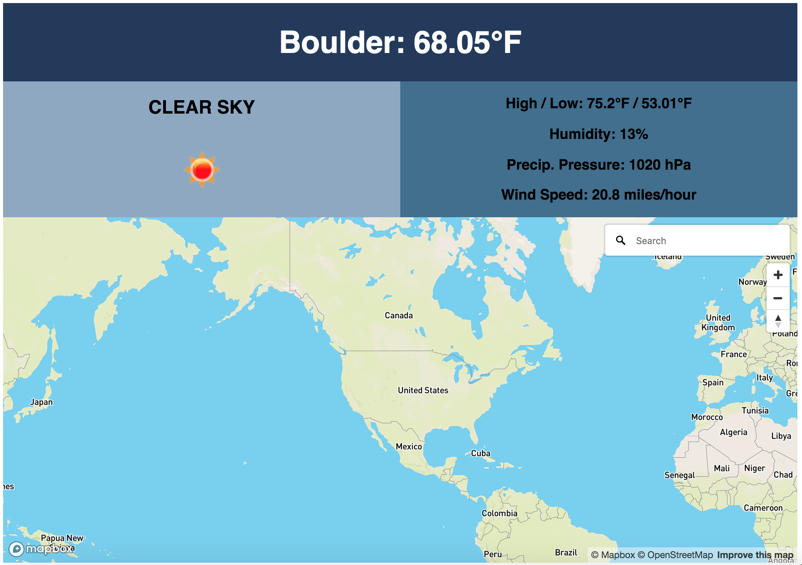
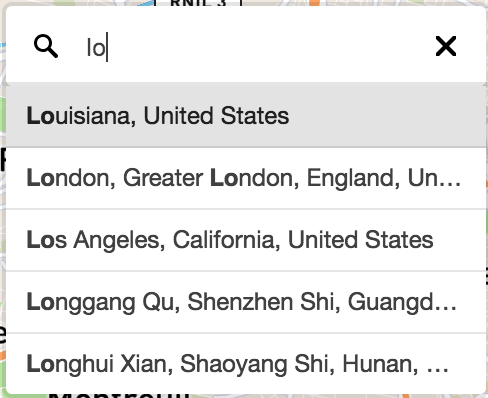
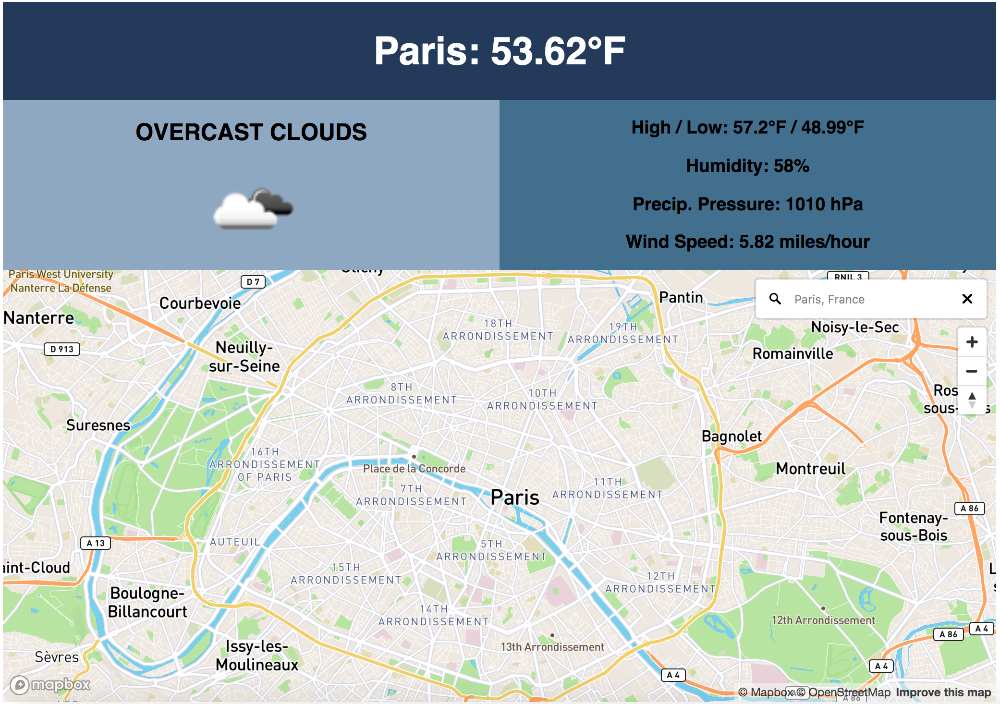

# Ageagle Challenge

## Introduction
This is a weather app that allows users to search a location on the map to find the current weather conditions.

## Initial Setup

These instructions will get you a copy of the project up and running on your local machine for development and testing purposes.

From GitHub clone down repository using the following commands in terminal:
* `git@github.com:jplao/Ageagle.git`
* `cd Ageagle`

## How to Use

### Running the Server Locally

To run the server locally run:
* `npm start`

In your browser visit:
* `http://localhost:8080/` to run your application.

### Home Page

When visitors first visit the page they will see the current temperature for Boulder, Colorado and a map.

Users can enter a location into the search box and will be given location suggestions.

Entering a location (or choosing a suggested location) will update the weather data to display weather for the searched location and will recenter the map around that searched location.

## Core Contributors
* Jennifer Lao - Github: [jplao](https://www.github.com/jplao)

## Built With

* [JavaScript](https://www.javascript.com/)
* [jQuery](https://jquery.com/)
* [Express](https://expressjs.com/)
* [Mocha](https://mochajs.org/)
* [Chai](https://chaijs.com/)

## GitHub Pages Setup

To view this project in production visit <https://jplao.github.io/Ageagle/>.
